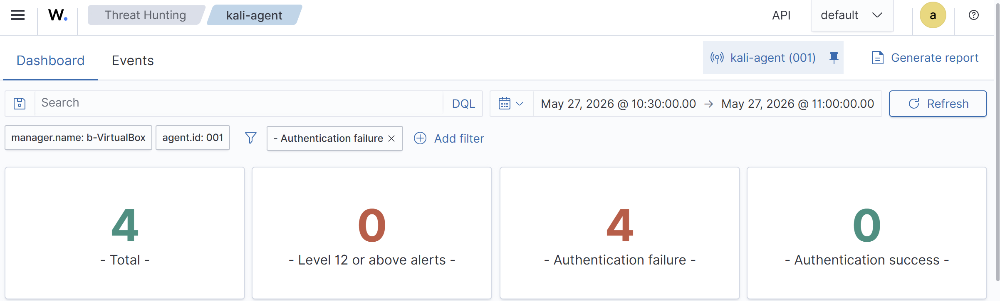
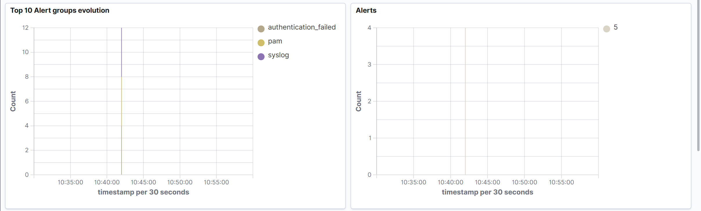
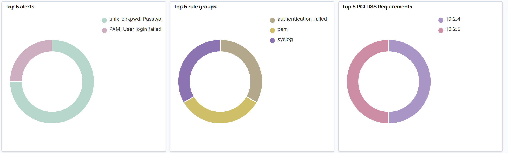

# Failed Sudo Authentication Detection

## Objective

Detect failed sudo authentication attempts from the monitored Kali Linux endpoint using Wazuh.

## Environment

| Component | Description |
|---|---|
| SIEM Platform | Wazuh |
| Wazuh Server | Ubuntu VM |
| Monitored Endpoint | Kali Linux VM |
| Agent Name | kali-agent |
| Event Type | Failed sudo authentication |

## Test Activity

A failed sudo authentication event was generated on the Kali Linux endpoint by attempting to run a privileged command with an incorrect password.

```bash
sudo su
```

## Detection Summary

| Field | Value |
|---|---|
| Source Endpoint | kali-agent |
| Event Category | Authentication |
| Event Type | Failed sudo authentication |
| Severity | Low / Medium |
| Status | Detected |

## Expected Log Indicators

Example indicators that may appear in the Wazuh alert:

```text
sudo
authentication failure
pam_unix
failed password
incorrect password attempt
```

## Security Relevance

Failed sudo authentication attempts may indicate mistyped credentials, unauthorized privilege escalation attempts, or suspicious local activity. In a SOC environment, repeated failed sudo attempts should be reviewed to determine whether they are benign user error or malicious behavior.

## Analyst Notes

- Confirm whether the activity was expected or authorized.
- Review the source endpoint and user account involved.
- Check for repeated failed attempts within a short time window.
- Look for successful privilege escalation after failed attempts.

## Recommended Response

1. Verify the user and endpoint involved.
2. Determine whether the failed attempts were expected.
3. Review additional authentication logs around the same timeframe.
4. Escalate if repeated failures or suspicious commands are observed.

## Evidence





## Conclusion

The Wazuh agent successfully collected authentication-related activity from the Kali Linux endpoint. The failed sudo attempt was detected and reviewed as a basic SOC authentication event.
